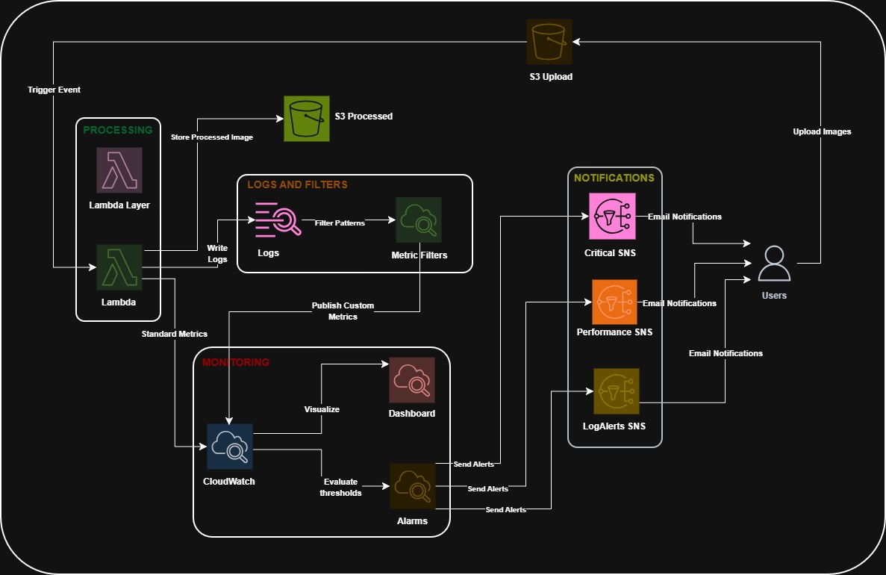
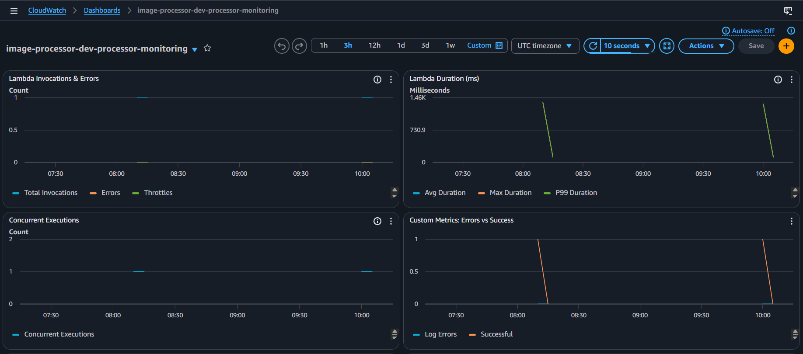
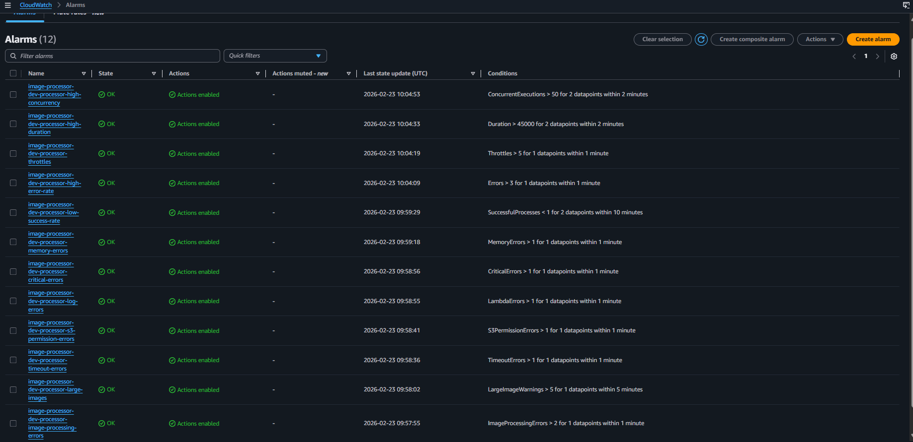
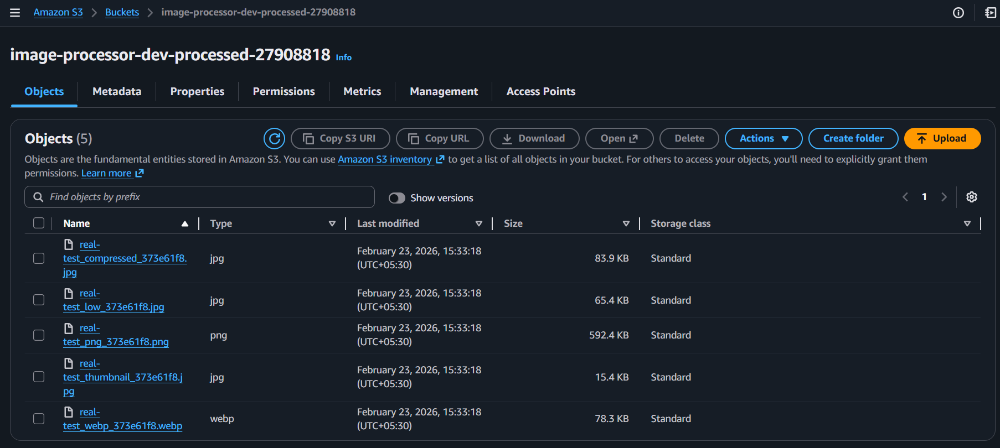
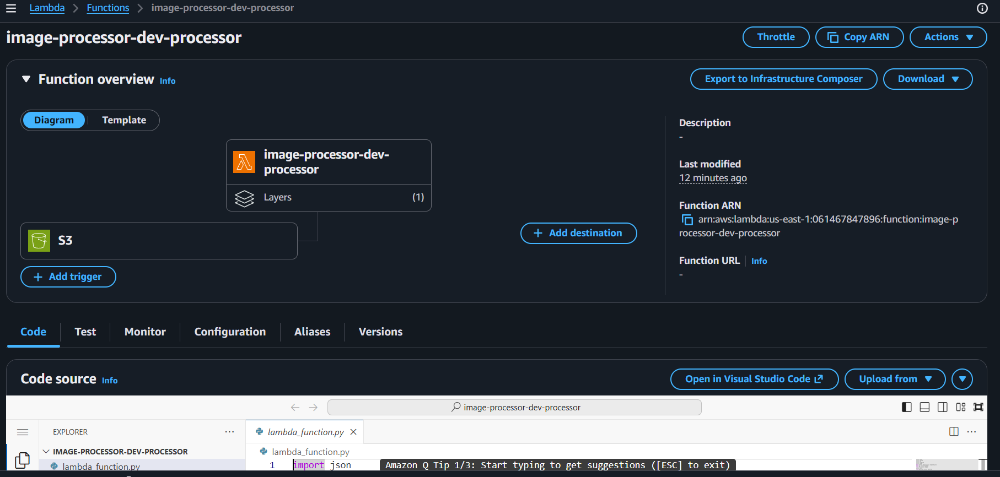
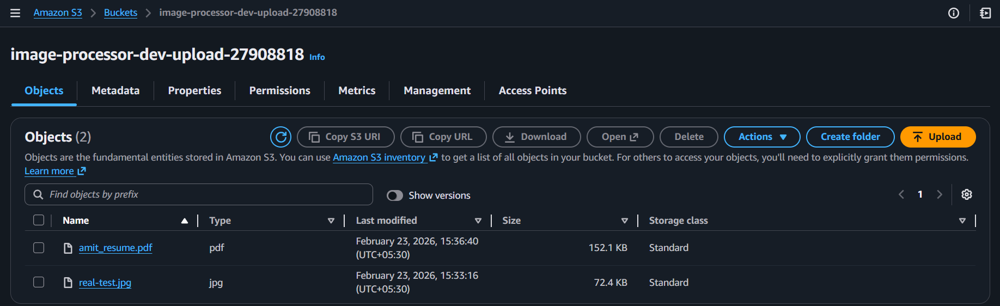
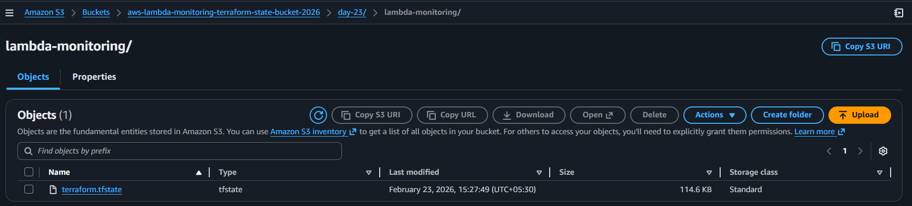

# End-to-End Observability in AWS Using Terraform

This repository contains multiple AWS observability projects built with Terraform. Each project demonstrates a different monitoring pattern using AWS-native tools.

---

## 📁 Projects

### 🔬 1. AWS Lambda Image Processor with Full Observability (`aws-lambda-monitoring/`)

An event-driven serverless **image processing pipeline** with enterprise-grade monitoring built using modular Terraform.

**What it does:**
- Automatically processes images uploaded to S3 (creates 5 variants: compressed JPEG, low-quality JPEG, WebP, PNG, Thumbnail)
- Monitors everything with **12 CloudWatch Alarms**, a live **Dashboard**, and **SNS email alerts**
- Uses **custom metrics**, **log-based metric filters**, and **structured logging**

**Architecture:**



**Key Features:**
| Feature | Details |
|---|---|
| Lambda Runtime | Python 3.12 with Pillow layer |
| S3 Buckets | Upload (source) + Processed (destination) |
| CloudWatch Alarms | 12 alarms covering errors, duration, throttles, memory, timeouts, PIL errors |
| SNS Topics | 3 topics: Critical, Performance, Log Alerts |
| Dashboard | Auto-created with 7 metric widgets |
| Terraform Modules | 6 reusable modules |

📖 **Full documentation:** [`aws-lambda-monitoring/README.md`](aws-lambda-monitoring/README.md)  
⚡ **Quick start:** [`aws-lambda-monitoring/QUICK_START.md`](aws-lambda-monitoring/QUICK_START.md)  
🎬 **Demo guide:** [`aws-lambda-monitoring/DEMO_GUIDE.md`](aws-lambda-monitoring/DEMO_GUIDE.md)

---

### 🔒 2. S3 Security & Operations Monitoring (`s3-security-monitoring.backup/`)

A **security monitoring stack** for an S3 bucket using CloudTrail, CloudWatch Logs, Metric Filters, and CloudWatch Alarms. Sends email alerts via SNS when suspicious activity occurs.

**What it monitors:**
- `AccessDenied` / `403` errors on any S3 object
- Access to restricted prefixes (e.g., `private/*`)

**Architecture:**
1. **S3 Bucket** — A monitored bucket (with random suffix)
2. **CloudTrail** — Logs data events (object-level activity)
3. **CloudWatch Logs** — Receives CloudTrail logs
4. **Metric Filters** — Scans logs for `AccessDenied`, `403`, and restricted prefix access
5. **CloudWatch Alarms** — Triggers when metrics exceed threshold (1 event)
6. **SNS** — Sends email notification when alarm triggers

**Usage:**
```bash
cd s3-security-monitoring.backup
terraform init
terraform plan -var="security_alert_email=your-email@example.com"
terraform apply -var="security_alert_email=your-email@example.com"
```

📖 **Demo guide:** [`s3-security-monitoring.backup/DEMO_GUIDE.md`](s3-security-monitoring.backup/DEMO_GUIDE.md)

---

## 🛠️ Prerequisites

- [Terraform](https://developer.hashicorp.com/terraform/install) `>= 1.0`
- [AWS CLI](https://aws.amazon.com/cli/) configured with appropriate permissions
- [Docker](https://docs.docker.com/get-docker/) (for building the Pillow Lambda layer)

## 📸 Screenshots

| CloudWatch Dashboard | 12 Alarms Active | Processed S3 Bucket |
|---|---|---|
|  |  |  |

| Lambda Function | Upload Bucket | Terraform State Backend |
|---|---|---|
|  |  |  |

---

## ⚠️ Security Notes

- **Never commit `terraform.tfvars`** — it contains real email addresses. It is protected by `.gitignore`.
- Use `terraform.tfvars.example` as a safe template to share with others.
- All S3 buckets have public access fully blocked and server-side encryption (AES256) enabled.
- Lambda IAM role uses least-privilege permissions (only `GetObject` on upload bucket, only `PutObject` on processed bucket).

---

*Built with ❤️ using AWS + Terraform*